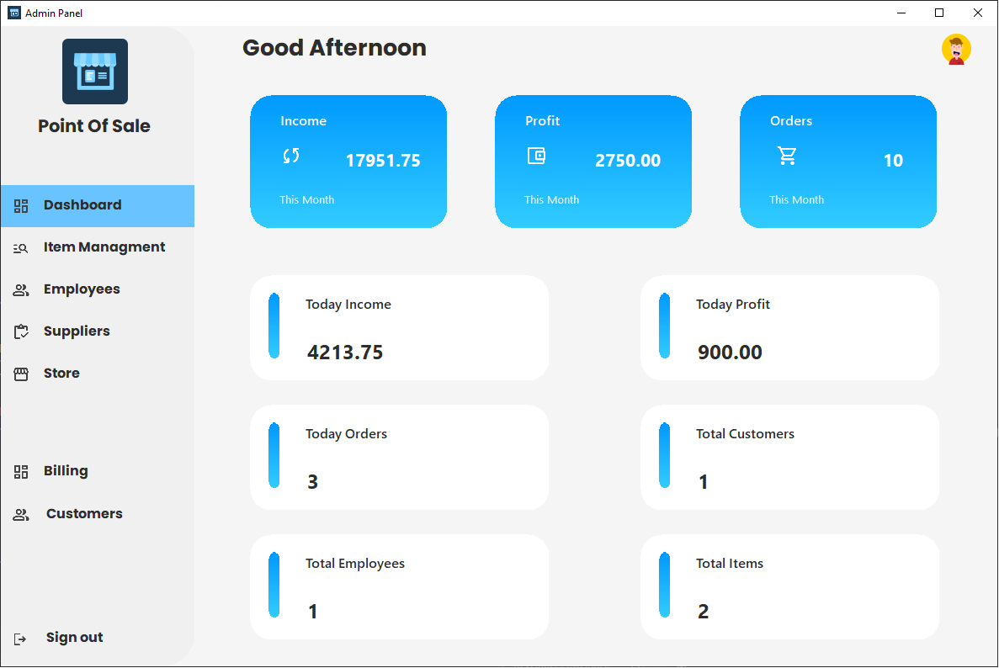
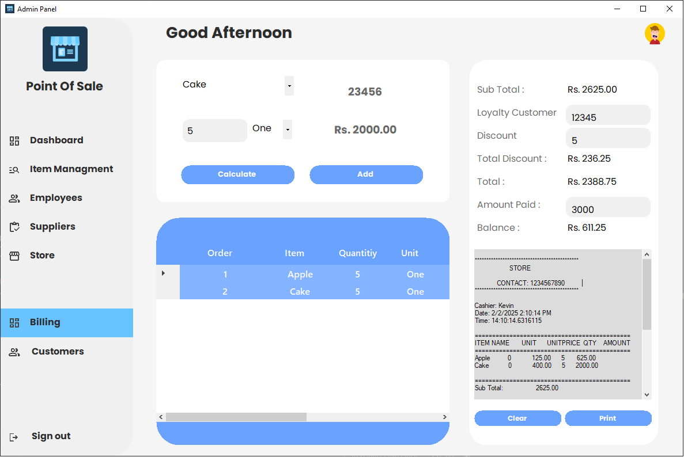

# 📌 Point of Sale (POS) System

## 📝 Overview
This POS system is designed to manage sales, items, and employee operations in a retail environment. It is built using **C# (.NET Windows Forms)** and **SQL Server**, providing a user-friendly interface for both employees and administrators.

## 🚀 Features
- 🔹 **Sales Management** – Process sales transactions efficiently.  
- 🔹 **Item Management** – Add, update, and track items in inventory..  
- 🔹 **Employee Management** – Control access and track user activity.  
- 🔹 **Reports & Analytics** – View sales reports and performance metrics.  
- 🔹 **Custom UI Components** – Modern buttons and text fields for a better user experience.  

## 🖥️ Screenshots
Here are some previews of the application:

## 🛠️ Technologies Used
- **C# (.NET Windows Forms)** – For the application frontend  
- **SQL Server** – For database management  
- **Visual Studio** – For development  

## 🛠 Database Setup
1. Open **SQL Server Management Studio (SSMS)**.  
2. Run the script found in **`database/setup.sql`**.  
3. Update the connection string in `app.config`. 

